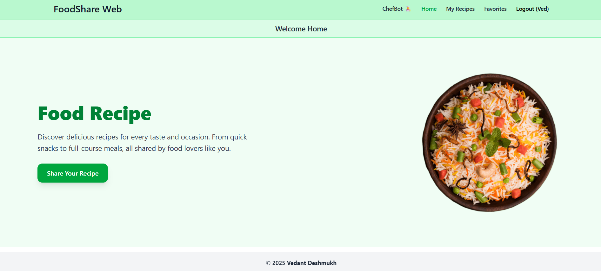
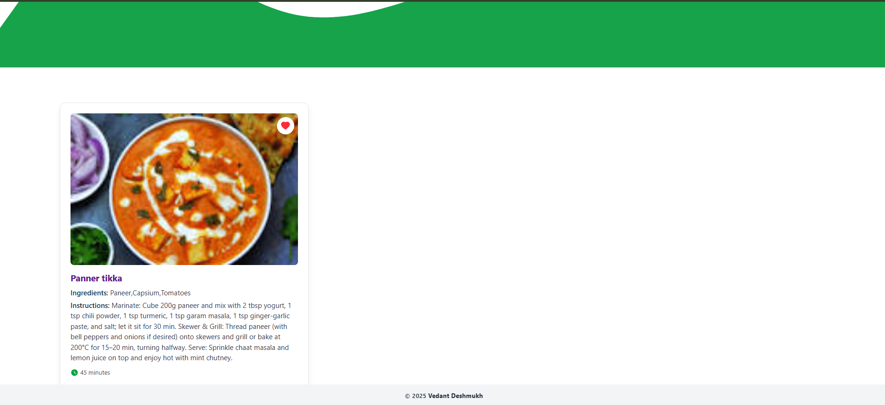
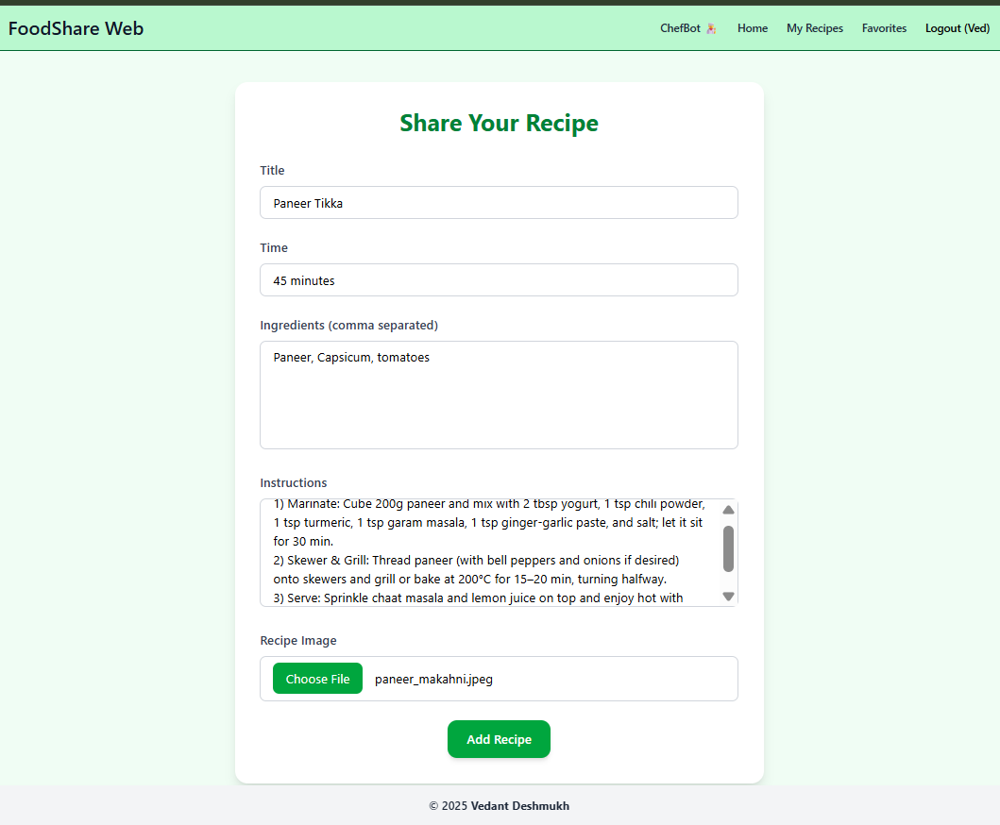

# 🥗 FoodShare Web – Recipe Sharing App

A full-stack **Food Recipe Sharing Website** where users can register, log in securely, share their favorite food recipes, manage their own recipes, and interact with a **chefbot AI assistant**.

---

##  Hosted Link

Check out the live app here: <a href="https://recipeblog-share.vercel.app/" target="_blank">FoodShare Web Live</a>

---

##  Features

-  **Recipe Management** – Create, edit, view recipes
-  **Favorites & My Recipes** – Save your favorite recipes and manage your own recipes
-  **AI Chatbot Assistant** – Ask any recipe-related questions or get cooking suggestions
-  **JWT Authentication** – Secure login and signup
-  **Protected Routes** – Token-based access control
-  **Responsive UI** – Built with Tailwind CSS, mobile & desktop compatible
-  **Modular Frontend** – Component-based React architecture
-  **Dockerized Setup** – Run frontend and backend with Docker & Docker Compose

---

## Tech Stack

- **Frontend:** React, Axios, Tailwind CSS
- **Backend:** Node.js, Express.js
- **Database:** MongoDB (via Mongoose)
- **Authentication:** JWT (JSON Web Tokens)
- **AI Assistant:** OpenAI API for recipe chat functionality
- **Containerization:** Docker, Docker Compose

---

##  Project Structure

```
food-blog/
├── backend/
│   ├── models/
│   ├── routes/
│   ├── controllers/
│   └── Dockerfile
│   └── server.js
│
├── frontend/
│   ├── src/
│   │   ├── components/
│   │   ├── pages/
│   │   └── App.jsx
│   └── Dockerfile
│   └── vite.config.js
│
├── docker-compose.yml
├── .env
├── README.md
└── package.json
```

---

##  Setup Instructions

### 1. Clone the Repository

```bash
git clone https://github.com/your-username/food-blog.git
cd food-blog
```

### 2. Dockerized Setup (Recommended)

Make sure you have Docker and Docker Compose installed.

Run the entire stack (frontend + backend + MongoDB) using:

```bash
docker-compose up --build
```

This will:
- Build frontend and backend Docker images
- Start the containers and link them together
- Run the backend on port 5000 and frontend on port 5173

> Note: Ensure your `.env` file exists in the root or backend directory as configured in your Dockerfile.

### 3. Manual Backend Setup (Optional)

```bash
cd backend
npm install
```

Create a `.env` file inside the `backend/` directory:

```env
PORT=5000
MONGO_URI=your_mongodb_connection_string
JWT_SECRET=your_secret_key
OPENAI_API_KEY=your_openai_api_key
```

Start the backend server:

```bash
npm run dev
```

### 4. Manual Frontend Setup (Optional)

```bash
cd frontend
npm install
npm run dev
```

> Make sure your frontend is configured to call the backend API at `http://localhost:5000`.

---

##  UI Snapshots

**Home Page with Recipe List**




**Add Recipe**



**AI Chatbot Assistant**


---

## Author

**Vedant Deshmukh**
- LinkedIn: <a href="https://www.linkedin.com/in/vedant-deshmukh-47b1a122a/" target="_blank">Vedant Deshmukh</a>

