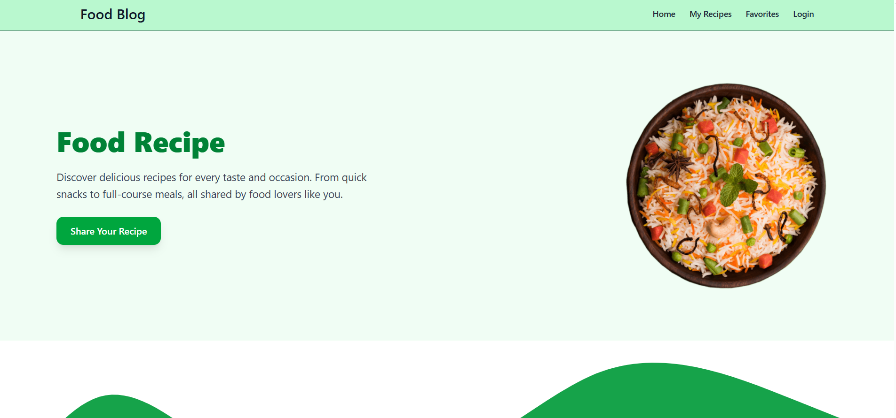
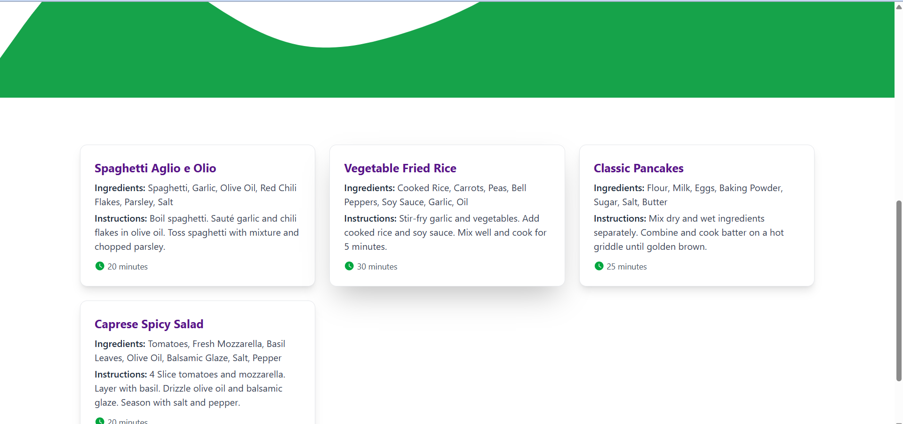

# 🥗 Food Recipe Blog – MERN Stack App

A full-stack **Food Recipe Sharing Website** where users can create accounts, log in securely, and share their favorite food recipes with the community.

---

## 🚀 Features

- 🔐 JWT Authentication – Secure login & signup
- 📝 Create, Edit, View Recipes
- 🎨 Responsive and clean UI with Tailwind CSS
- 🧠 Organized component-based frontend
- 🛡️ Protected routes and token-based access control

---

## 🧱 Tech Stack

**MERN Stack**:

- **Frontend:** React, Axios, Tailwind CSS
- **Backend:** Node.js, Express
- **Database:** MongoDB (Mongoose)
- **Authentication:** JWT (JSON Web Tokens)

---

## 📁 Project Structure

food-blog/
├── backend/
│ ├── models/
│ ├── routes/
│ ├── controllers/
│ └── server.js
│
├── frontend/
│ ├── src/
│ │ ├── components/
│ │ ├── pages/
│ │ └── App.jsx
│ └── vite.config.js
│
├── .env
├── README.md
└── package.json

yaml
Copy
Edit

---

## ⚙️ Setup Instructions

### 1. Clone the Repository

```bash
git clone https://github.com/your-username/food-blog.git
cd food-blog
2. Backend Setup
bash
Copy
Edit
cd backend
npm install
Create .env file inside backend/:
env
Copy
Edit
PORT=5000
MONGO_URI=your_mongodb_connection_string
JWT_SECRET=your_secret_key
Start backend server:

bash
Copy
Edit
npm run dev
3. Frontend Setup
bash
Copy
Edit
cd frontend
npm install
npm run dev
Ensure the frontend makes API calls to http://localhost:5000.

🔐 Authentication Flow
Users sign up or log in via modal.

JWT token is returned and stored in localStorage.

Protected routes use the token for access.

Recipes can be added/edited only by authenticated users.


Home Page with Recipe List




🧑‍💻 Author
Vedant Deshmukh
GitHub: @Vedantspit
LinkedIn: [LinkedIn](https://www.linkedin.com/in/vedant-deshmukh-47b1a122a/?lipi=urn%3Ali%3Apage%3Ad_flagship3_feed%3BC8O07jGZRAGbPzsXduJaqQ%3D%3D)
```
