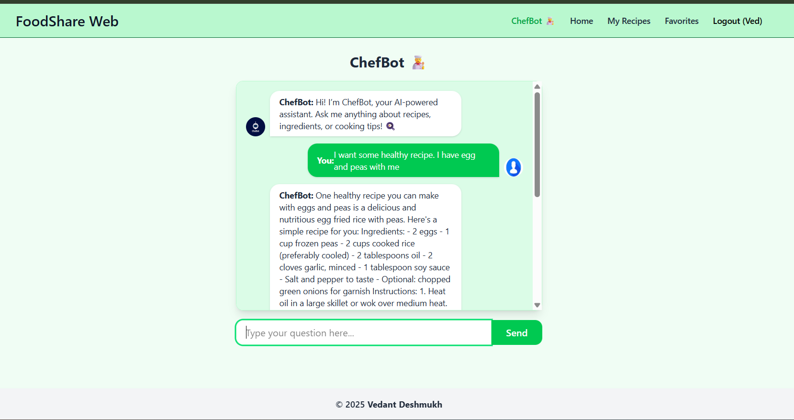

# FoodShare Web – Recipe Sharing App

A full-stack **Food Recipe Sharing Website** where users can register, share their favorite recipes, manage their own dishes, and interact with an **AI-powered chefbot assistant**.

---

## Live Demo

**Check it out here:** [FoodShare Web Live](https://recipeblog-share.vercel.app/)

---

## Features

- **Recipe Management:** Create, edit, and browse recipes easily
- **Favorites & My Recipes:** Save your favorite dishes and manage your personal recipes
- **AI ChefBot Assistant:** Get recipe suggestions or cooking help powered by OpenAI API
- **User Authentication:** Secure signup and login with JWT-based access
- **Responsive Design:** Built with Tailwind CSS for mobile and desktop
- **Dockerized Setup:** Run both frontend and backend using Docker Compose

---

## Tech Stack

- **Frontend:** React, Axios, Tailwind CSS
- **Backend:** Node.js, Express.js
- **Database:** MongoDB (Mongoose ORM)
- **AI Integration:** OpenAI API for chatbot assistant
- **Authentication:** JWT-based token authentication
- **Containerization:** Docker & Docker Compose

---

## Project Structure

```
food-blog/
├── backend/
│   ├── models/
│   ├── routes/
│   ├── controllers/
│   ├── Dockerfile
│   └── server.js
│
├── frontend/
│   ├── src/
│   │   ├── components/
│   │   ├── pages/
│   │   └── App.jsx
│   ├── Dockerfile
│   └── vite.config.js
│
├── docker-compose.yml
├── .env
├── README.md
└── package.json
```

---

## Setup Instructions

### 1. Clone the Repository

```bash
git clone https://github.com/your-username/food-blog.git
cd food-blog
```

### 2. Dockerized Setup (Recommended)

Make sure you have **Docker** and **Docker Compose** installed.  
Run the stack (frontend + backend + MongoDB) using:

```bash
docker-compose up --build
```

This will:

- Build frontend and backend images
- Start the containers and link them
- Run backend on port **5000** and frontend on **5173**

> Ensure your `.env` file exists in the root or `backend/` directory as configured.

### 3. Manual Backend Setup (Optional)

```bash
cd backend
npm install
```

Create a `.env` file inside `backend/`:

```
PORT=5000
MONGO_URI=your_mongodb_connection_string
JWT_SECRET=your_secret_key
OPENAI_API_KEY=your_openai_api_key
```

Run the backend server:

```bash
npm run dev
```

### 4. Manual Frontend Setup (Optional)

```bash
cd frontend
npm install
npm run dev
```

> Make sure the frontend API calls point to `http://localhost:5000`.

---

## UI Snapshots

**Home Page**  
  


**Add Recipe Page**  


**AI Chatbot Assistant**  


